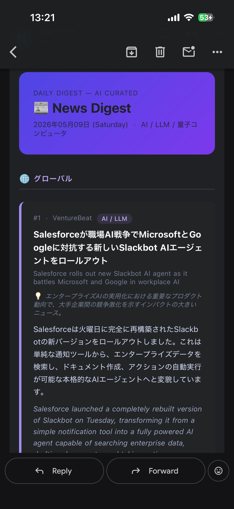

# AI-dailynews

## 概要
自分の興味に関連する最新のニュースを手軽に見るために作りました。

## デモ
実際に届いたメールのスクリーンショット


## 技術スタック
GitHub Actions / Claude Haiku API / Python / Gmail SMTP

## 工夫した点
- Claude に重要度で記事を選ばせる設計
  生成AIを使って自分が見たいトピックに関するニュースを拾うようにしました。
- 複数トピックをconfig.yamlで管理
  基本的に個人で使うのがメインなので、トピックの変更を簡単にできるようにしました。

## セットアップ
### 1. リポジトリを作成

GitHub に **private リポジトリ** を作成し、このファイル群を push する。

### 2. Gmail のアプリパスワードを取得

1. Google アカウント → セキュリティ → 2段階認証をオンに
2. 「アプリ パスワード」で新規作成（名前は任意）
3. 生成された 16 文字のパスワードを控えておく

> ⚠️ 通常のGmailパスワードではなくアプリパスワードが必要です

### 3. GitHub Secrets を登録

リポジトリの **Settings → Secrets and variables → Actions → New repository secret** で以下を登録：

| Secret 名 | 値 |
|---|---|
| `ANTHROPIC_API_KEY` | Anthropic コンソールの API キー |
| `GMAIL_USER` | 送信元 Gmail アドレス（例: yourname@gmail.com） |
| `GMAIL_APP_PASSWORD` | 手順2で取得した16文字のパスワード |
| `TO_EMAIL` | 送信先アドレス（自分宛なら GMAIL_USER と同じ） |

### 4. 動作確認（手動実行）

GitHub → Actions タブ → `Daily AI News Digest` → `Run workflow`

ログに `✅ 送信完了` が出て Gmail が届けば成功！

---

## カスタマイズ

`config.yaml` を編集するだけで変更できます。

```yaml
topic: "AI / 生成AI / LLM"   # ← メールのタイトルに表示

rss_global:                   # ← グローバルニュースのRSSを追加・削除

rss_japan:                    # ← 日本語ニュースのRSSを追加・削除

hackernews_keywords:          # ← HNフィルタのキーワードを追加・削除
```

### 別トピックに切り替える例

```yaml
topic: "量子コンピュータ"

rss_global:
  - "https://news.google.com/rss/search?q=quantum+computing&hl=en-US&gl=US&ceid=US:en"

rss_japan:
  - "https://news.google.com/rss/search?q=%E9%87%8F%E5%AD%90%E3%82%B3%E3%83%B3%E3%83%94%E3%83%A5%E3%83%BC%E3%82%BF&hl=ja&gl=JP&ceid=JP:ja"

hackernews_keywords:
  - "quantum"
  - "qubit"
```

### 送信時刻の変更

`.github/workflows/daily_news.yml` の cron を変更：

```yaml
# 例: 毎朝 8:00 JST → UTC 23:00
- cron: "0 23 * * *"
```
